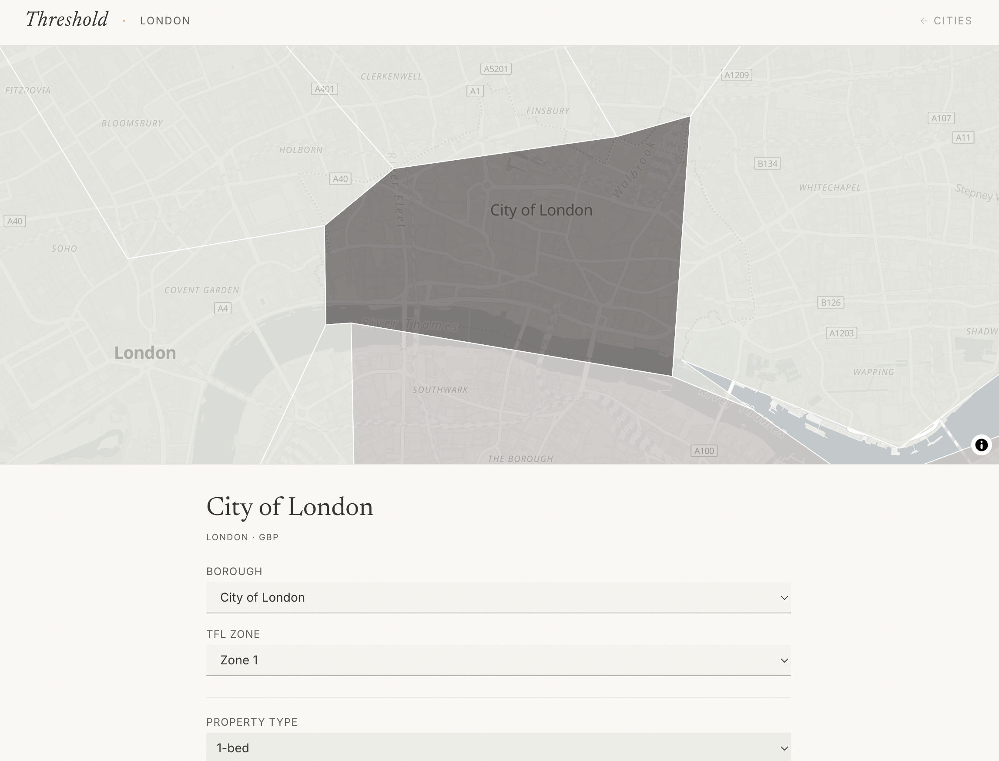
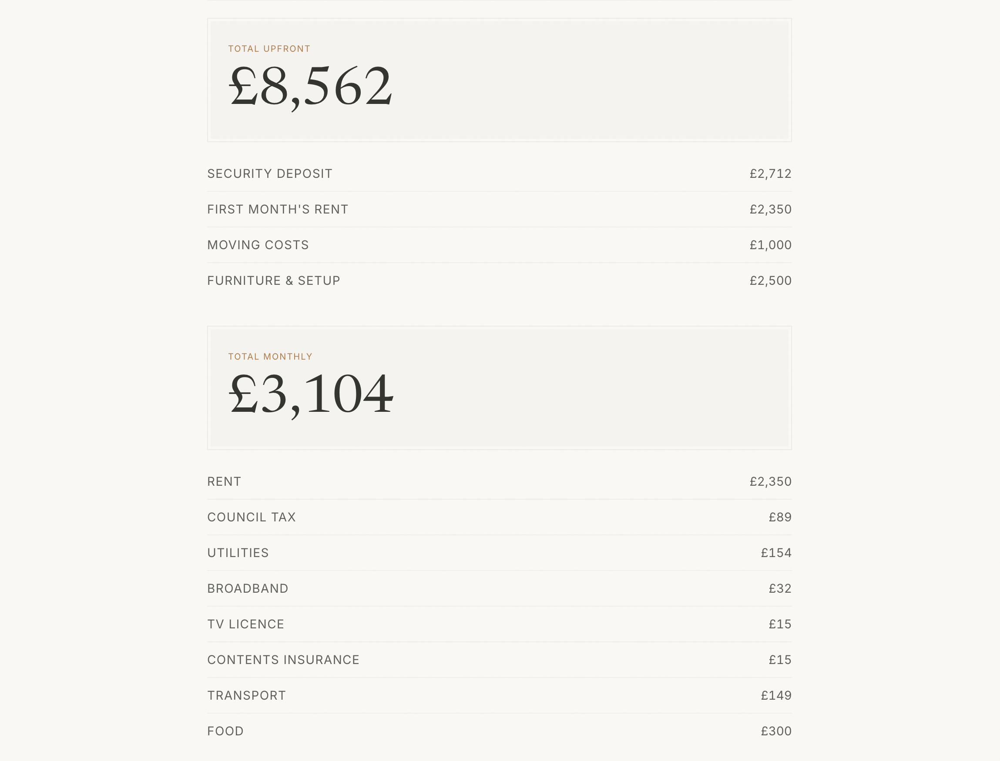

# Threshold

**The real cost of moving out** — a rental affordability calculator for London, Basel, and Zurich.

[Use the live calculator](https://threshold-beta.vercel.app) · [](https://github.com/3ixas/threshold/actions/workflows/ci.yml)

Select a city and district, set your living situation, and get an immediate breakdown of the money needed on day one and each month after.


## What it calculates

Most rent calculators stop at monthly rent. Threshold combines rent with the other costs that determine whether moving is actually affordable:

| Upfront costs | Monthly costs |
|---|---|
| Security deposit | Rent |
| First month's rent | Council tax or local equivalent |
| Moving costs | Utilities and broadband |
| Furniture and setup | Transport |
| | Health insurance where applicable |
| | Media fees, contents insurance, food, and lifestyle |

Results update without a submit step. Every configuration is encoded in the URL, so a scenario can be bookmarked, shared, and restored without an account or backend.

<table>
  <tr>
    <td width="50%"></td>
    <td width="50%"></td>
  </tr>
</table>

## Engineering decisions

- **URL as application state:** calculator inputs are serialised to `URLSearchParams`, avoiding a global client store while making every scenario shareable.
- **Pure calculation core:** affordability, cost, comparison, and suggestion logic stays separate from React and is covered by unit tests without network mocks.
- **Configuration by city:** rent, transport, tax, insurance, and district geometry are represented as typed city data rather than spread through UI components.
- **Progressive loading:** routes and map code are loaded only when needed, keeping the landing route smaller.

## Data and limitations

The bundled data was last reviewed in **April 2026**:

- London rent uses ONS Private Rental Market Statistics for 2025; borough boundaries use ONS geography data; transport uses published TfL fares.
- Basel and Zurich use Numbeo city baselines with district-level price relativities; transport uses published TNW and ZVV prices.
- Local deposit rules, council tax, Swiss health insurance, utilities, and recurring fees are represented as documented estimates in each city configuration.

Some district values are estimates where official samples were unavailable, and actual costs vary by property, household, provider, and personal circumstances. Threshold is an indicative planning tool, not financial advice.

## Stack

- React 19, TypeScript in strict mode, and Vite
- Tailwind CSS 4 and Framer Motion with reduced-motion support
- MapLibre GL and React Map GL
- React Router 7
- Vitest and Testing Library

## Run locally

```bash
npm ci
npm run dev
```

The development server runs at `http://localhost:5173`.

## Verify

```bash
npm run lint
npm test
npm run build
```

The test suite covers calculations, data invariants, URL round-tripping, suggestions, comparisons, and the main UI flows.

## Project structure

```text
src/
├── data/        # City costs, districts, transport, and map boundaries
├── lib/         # Pure calculations and URL-state serialisation
├── components/  # Maps, controls, affordability, and comparisons
└── pages/       # Landing and calculator routes
```
